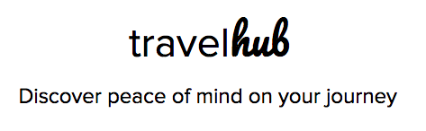

  
2018 Hack Your Trip Hackathon - Seattle, WA

### The Challenge
Hack the travel industry by using two to three of Discover’s APIs to create an innovative solution with the goal of improving the travel experience.

### Motivation
Over 50% of U.S. vacationers admit they're more stressed today compared to a year ago, and it's causing more than one in three (37%) to cancel or delay their trip, according to a survey by Wyndham Vacation Rentals (2017). How can we mitigate this stress?

#### seal_team_404
* Abhi Banerjee
* Andrew Nicholls
* Diep Truong
* Chris Peterson
* Diane Chiang

### Our Project
travelHUB provides a seamless user experience from door to seat, while reinforcing the Discover brand & collecting insight on customer behavior.

### Unique Features
* Discover Now Augmented Reality (AR)
* Time Series Forecasting with Facebook Prophet to predict airport wait times
* Back-end data analytics platform for extracting user behavior

### Links
- Presentation Slides: http://bit.ly/2Ekzqy9
- GitHub: https://github.com/drunkONdata/discover_hack

### Future Work
* Validate Discover Merchants with user feedback
* Deploy “Discover Now” AR 
* Leverage data analytics platform to drive merchant acceptance
* Deploy ML predictive models on data
